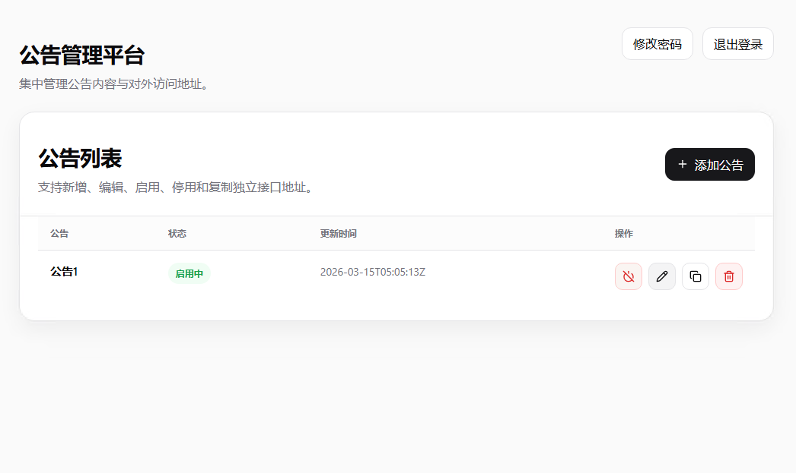

# 公告管理平台

这是一个使用原生 PHP 开发的公告管理平台，包含后台管理和对外公告接口，使用SQLite数据库，访问自动初始化数据库，支持停用启用，支持get和post请求获取公告。
## 界面预览


## 运行环境

建议使用以下环境：

- PHP 8.1 及以上
- PHP 扩展 `pdo_sqlite`
- Nginx 或 Apache

服务器推荐：[首月五折，永久年付七折](https://www.rainyun.com/?ref=MjM1MjI=
)


## 默认密码

默认账号：`admin`
默认密码：`123456`

## Nginx 配置

```nginx
location / {
    try_files $uri $uri/ /index.php?$query_string;
}
```

## Apache 配置

如果你使用 Apache，可以使用项目根目录下的 `.htaccess` 文件。内容如下：

```apache
RewriteEngine On

RewriteCond %{REQUEST_FILENAME} !-f
RewriteCond %{REQUEST_FILENAME} !-d
RewriteRule ^ index.php [QSA,L]
```

## 后台功能

后台支持以下操作：

- 新增公告
- 编辑公告
- 启用公告
- 停用公告
- 删除公告
- 复制接口地址

## 公告接口

每条公告都有独立接口地址，格式如下：

```text
/api/announcement/{token}
```

支持两种请求方式：

- `GET`
- `POST`

返回格式统一为：

```json
{
  "code": 0,
  "message": "获取成功",
  "data": {
    "id": 1,
    "title": "系统维护通知",
    "content": "今晚 23:00 至 23:30 进行维护。",
    "updated_at": "2026-03-15T10:00:00Z"
  }
}
```

如果公告不存在或已停用，将返回错误信息。
